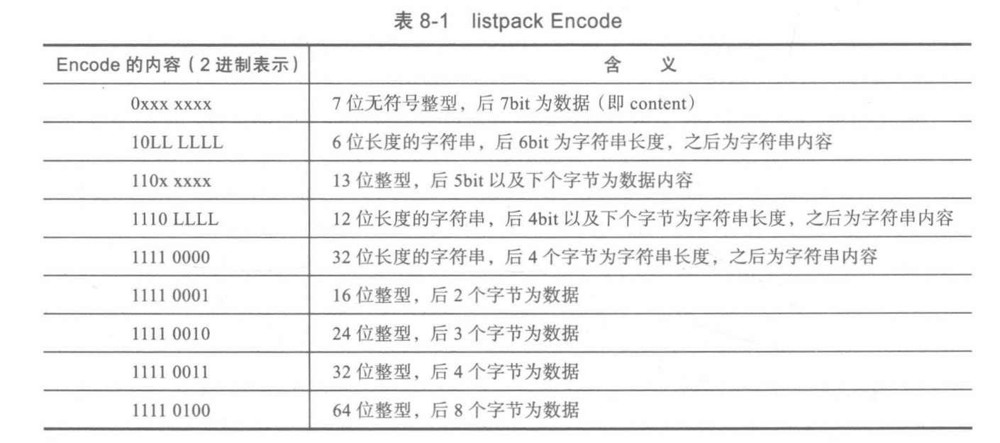

SkipList
https://github.com/Shy2593666979/Redis-SkipList

HyperLogLog
https://zhuanlan.zhihu.com/p/58519480


listpack

Redis 源码对于listpack的解释为“A list of strings serialization format”，一个字符串列表的序列格式化，也就是将一个字符串进行序列化存储。Redis listpack 可以用来存储整型或则字符串，结构如下

```cpp
// <Total Bytes><Num Elem><Entry1>...<EntryX><End>
// <Entry> --> <Encode><content><backlen>
```

1. Total Bytes 为整个listpack的空间大小，占用4个字节
2. Num Elem为listpack中元素的个数，即Entry的个数，占用两个字节，这并不意味着listpack最多只能存放65535个Entry，当Entry的个数超过65534时，Num Elem只保存65535，但是实际个数需要遍历来进行统计
3. End为结束标志，占用一个字节内容为0xFF，从代码看End其实应该两个字节，后面还有一个End自己的backlen？
4. Entry为listpack中具体的元素，Encode是该元素的编码方式占用一个字节，content是内容字段，backlen是前两者的总字节数，但不包含自身的字节数，一个backlen最多占用5个字节
5. 需要注意的是，整型存储中并不实际存储负数，而是将负数转换为正数进行存储，例如13位整型存储中[0,8191]，[0,4095]代表本身，[4096,8191]实际代表[-4096,-1]。



listpack.h/listpack.c中相关的代码基本都是对一个`unsigned char *`类型的变量进行操作，利用位运算进行bit尺度的赋值，根据listpack设计规则提供相关接口，如插入，删除，判断，统计等。